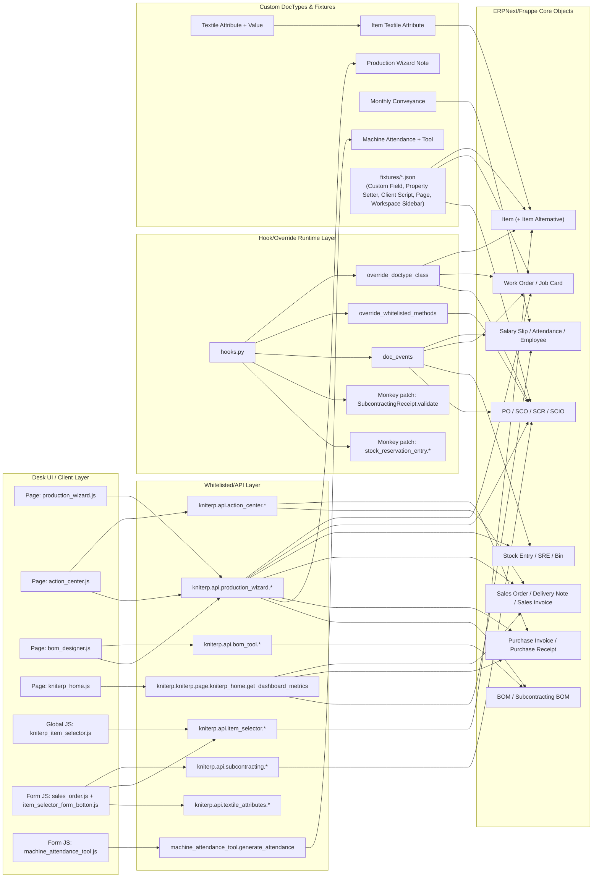
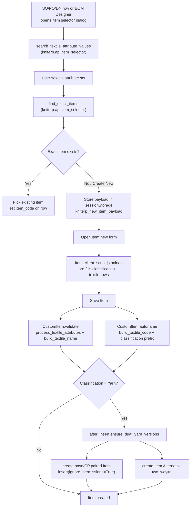
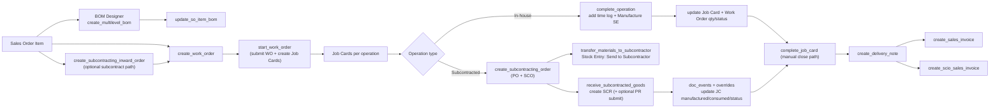
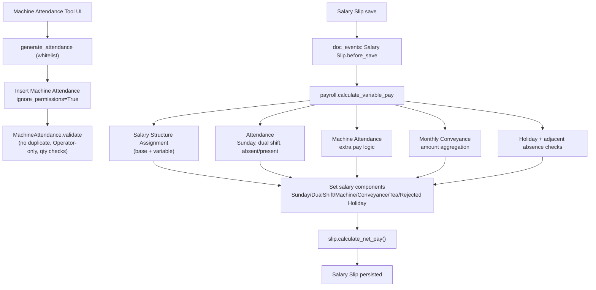
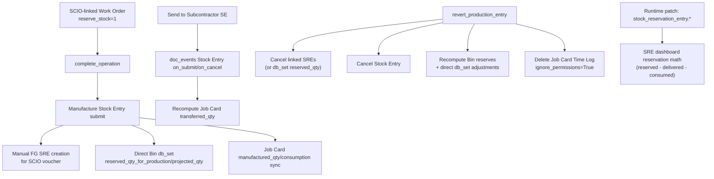
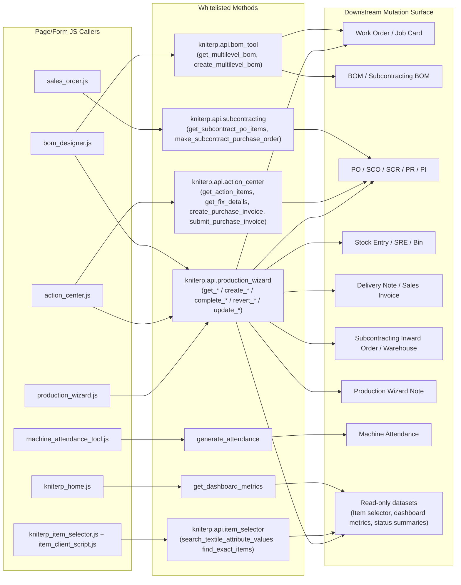

# KNITERP Architecture Review (Frappe v16)

This document is derived from static code/fixture discovery of `frappe-bench/apps/kniterp` and maps runtime architecture, data model, hook behavior, and end-to-end business flows.

## 1) System Architecture Diagram

Key anchors:
- `kniterp/hooks.py:34`, `kniterp/hooks.py:46`, `kniterp/hooks.py:53`, `kniterp/hooks.py:57`
- `kniterp/__init__.py:4`
- `kniterp/api/production_wizard.py:938`, `kniterp/api/action_center.py:6`, `kniterp/api/bom_tool.py:7`

## 2) ER Diagram (All Custom DocTypes)

```mermaid
erDiagram
    TEXTILE_ATTRIBUTE {
        string name PK
        string kniterp_attribute_name
        string kniterp_attribute_code
        string kniterp_field_type
        int kniterp_sequence
        int kniterp_affects_naming
        int kniterp_affects_code
        int kniterp_use_value_master
        int kniterp_is_active
    }

    TEXTILE_ATTRIBUTE_VALUE {
        string name PK
        string kniterp_attribute FK
        string kniterp_value
        string kniterp_short_code
        int kniterp_sort_order
        int kniterp_is_active
    }

    ITEM_ATTRIBUTE_APPLIES_TO_VALUES {
        string name PK
        string type_of_item
    }

    ITEM_ATTRIBUTE_APPLIES_TO {
        string parent FK
        string item_attribute_applies_to FK
    }

    ITEM_TEXTILE_ATTRIBUTE {
        string parent FK
        string kniterp_attribute FK
        string kniterp_value FK
        float kniterp_numeric_value
        string kniterp_display_value
        int kniterp_sequence
        int kniterp_affects_naming
        int kniterp_affects_code
        string kniterp_short_code
    }

    ITEM_TYPES_FOR_ATTRIBUTES {
        string name PK
        string item_types_for_attributes
    }

    MACHINE_ATTENDANCE_TOOL {
        string name PK
        date date
        string company FK
    }

    MACHINE_ATTENDANCE_ENTRY {
        string parent FK
        string machine FK
        string morning_employee FK
        float morning_production_kg
        string night_employee FK
        float night_production_kg
    }

    MACHINE_ATTENDANCE {
        string name PK
        string employee FK
        date date
        string shift FK
        string machine FK
        string company FK
        float production_qty_kg
    }

    MONTHLY_CONVEYANCE {
        string name PK
        string employee FK
        date month
        int total_km
        currency rate_per_km
        currency amount
    }

    PRODUCTION_WIZARD_NOTE {
        string name PK
        string sales_order FK
        string sales_order_item
        string item_code FK
        text note
    }

    ITEM {
        string name PK
        string custom_item_classification
    }

    SALES_ORDER {
        string name PK
    }

    EMPLOYEE {
        string name PK
    }

    WORKSTATION {
        string name PK
    }

    SHIFT_TYPE {
        string name PK
    }

    COMPANY {
        string name PK
    }

    TEXTILE_ATTRIBUTE ||--o{ TEXTILE_ATTRIBUTE_VALUE : "kniterp_attribute"
    TEXTILE_ATTRIBUTE ||--o{ ITEM_ATTRIBUTE_APPLIES_TO : "kniterp_applies_to"
    ITEM_ATTRIBUTE_APPLIES_TO_VALUES ||--o{ ITEM_ATTRIBUTE_APPLIES_TO : "item_attribute_applies_to"

    ITEM ||--o{ ITEM_TEXTILE_ATTRIBUTE : "custom_textile_attributes"
    TEXTILE_ATTRIBUTE ||--o{ ITEM_TEXTILE_ATTRIBUTE : "kniterp_attribute"
    TEXTILE_ATTRIBUTE_VALUE ||--o{ ITEM_TEXTILE_ATTRIBUTE : "kniterp_value"

    MACHINE_ATTENDANCE_TOOL ||--o{ MACHINE_ATTENDANCE_ENTRY : "entries"
    WORKSTATION ||--o{ MACHINE_ATTENDANCE_ENTRY : "machine"
    EMPLOYEE ||--o{ MACHINE_ATTENDANCE_ENTRY : "morning/night"

    EMPLOYEE ||--o{ MACHINE_ATTENDANCE : "employee"
    WORKSTATION ||--o{ MACHINE_ATTENDANCE : "machine"
    SHIFT_TYPE ||--o{ MACHINE_ATTENDANCE : "shift"
    COMPANY ||--o{ MACHINE_ATTENDANCE : "company"

    EMPLOYEE ||--o{ MONTHLY_CONVEYANCE : "employee"

    SALES_ORDER ||--o{ PRODUCTION_WIZARD_NOTE : "sales_order"
    ITEM ||--o{ PRODUCTION_WIZARD_NOTE : "item_code"
```

Key anchors:
- `kniterp/kniterp/doctype/*/*.json`
- `kniterp/fixtures/custom_field.json:75`, `kniterp/fixtures/custom_field.json:255`

## 3) Hook Interaction Diagram

```mermaid
flowchart TD
    BOOT["App import / site boot"] --> H1["kniterp/hooks.py"]
    BOOT --> H2["kniterp/__init__.py"]

    H1 --> I1["import overrides.subcontracting_receipt"]
    I1 --> P1["SubcontractingReceipt.validate = patched_validate"]

    H2 --> I2["import overrides.sre_dashboard_fix"]
    I2 --> P2["stock_reservation_entry fn reassignment"]

    H1 --> ODC["override_doctype_class"]
    ODC --> ODC1["Item -> CustomItem"]
    ODC --> ODC2["Job Card -> CustomJobCard"]
    ODC --> ODC3["Work Order -> CustomWorkOrder"]
    ODC --> ODC4["SCIO -> CustomSubcontractingInwardOrder"]

    H1 --> OWM["override_whitelisted_methods"]
    OWM --> OWM1["erpnext...make_subcontracting_po -> kniterp override"]

    H1 --> DEV["doc_events"]
    DEV --> E1["Salary Slip.before_save -> payroll.calculate_variable_pay"]
    DEV --> E2["Work Order.before_submit -> set_planned_qty_on_work_order"]
    DEV --> E3["Job Card.before_insert -> set_job_card_qty_from_planned_qty"]
    DEV --> E4["Purchase Receipt.on_submit -> subcontracting.on_pr_submit_complete_job_cards"]
    DEV --> E5["Subcontracting Receipt.on_submit -> overrides.subcontracting_receipt.on_submit_complete_job_cards"]
    DEV --> E6["Stock Entry.on_submit/on_cancel -> subcontracting.update_job_card_transferred"]

    H1 --> SCH["scheduler_events"]
    SCH --> NONE["No active scheduler hooks (commented template only)"]
```

Key anchors:
- `kniterp/hooks.py:1`, `kniterp/hooks.py:2`, `kniterp/hooks.py:46`, `kniterp/hooks.py:53`, `kniterp/hooks.py:57`, `kniterp/hooks.py:232`
- `kniterp/__init__.py:4`
- `kniterp/kniterp/overrides/subcontracting_receipt.py:21`
- `kniterp/kniterp/overrides/sre_dashboard_fix.py:64`

## 4) Item Lifecycle Flow

Key anchors:
- `kniterp/public/js/kniterp_item_selector.js:89`, `kniterp/public/js/kniterp_item_selector.js:201`, `kniterp/public/js/kniterp_item_selector.js:292`
- `kniterp/public/js/item_client_script.js:4`, `kniterp/public/js/item_client_script.js:13`, `kniterp/public/js/item_client_script.js:57`
- `kniterp/kniterp/overrides/item.py:7`, `kniterp/kniterp/overrides/item.py:23`, `kniterp/kniterp/overrides/item.py:120`, `kniterp/kniterp/overrides/item.py:218`

## 5) Manufacturing / Subcontracting Flow

Key anchors:
- `kniterp/api/production_wizard.py:938`, `kniterp/api/production_wizard.py:1135`, `kniterp/api/production_wizard.py:1229`, `kniterp/api/production_wizard.py:1507`, `kniterp/api/production_wizard.py:2079`, `kniterp/api/production_wizard.py:2326`, `kniterp/api/production_wizard.py:2499`, `kniterp/api/production_wizard.py:2628`, `kniterp/api/production_wizard.py:2737`
- `kniterp/subcontracting.py:86`, `kniterp/subcontracting.py:100`
- `kniterp/kniterp/overrides/subcontracting_receipt.py:24`

## 6) Payroll / HR Flow

Key anchors:
- `kniterp/hooks.py:59`
- `kniterp/payroll.py:9`, `kniterp/payroll.py:76`, `kniterp/payroll.py:118`, `kniterp/payroll.py:137`
- `kniterp/kniterp/doctype/machine_attendance_tool/machine_attendance_tool.py:10`, `kniterp/kniterp/doctype/machine_attendance_tool/machine_attendance_tool.py:43`
- `kniterp/kniterp/doctype/machine_attendance/machine_attendance.py:11`

## 7) Stock Impact Flow

Key anchors:
- `kniterp/api/production_wizard.py:1674`, `kniterp/api/production_wizard.py:1713`, `kniterp/api/production_wizard.py:1915`, `kniterp/api/production_wizard.py:1967`, `kniterp/api/production_wizard.py:1992`, `kniterp/api/production_wizard.py:2014`
- `kniterp/subcontracting.py:100`, `kniterp/subcontracting.py:106`, `kniterp/subcontracting.py:136`
- `kniterp/kniterp/overrides/sre_dashboard_fix.py:64`

## 8) API Interaction Map

High-risk API note:
- `kniterp.api.production_wizard.complete_job_card` is defined twice (`production_wizard.py:1761` and `production_wizard.py:3092`); later definition wins at import time.

Primary caller anchors:
- `kniterp/kniterp/page/production_wizard/production_wizard.js:213`
- `kniterp/kniterp/page/action_center/action_center.js:68`
- `kniterp/kniterp/page/bom_designer/bom_designer.js:35`
- `kniterp/public/js/sales_order.js:19`
- `kniterp/public/js/kniterp_item_selector.js:90`
- `kniterp/kniterp/doctype/machine_attendance_tool/machine_attendance_tool.js:93`
- `kniterp/kniterp/page/kniterp_home/kniterp_home.js:245`

---

## Architecture Observations (for review context)

1. Kniterp is organized as a custom operational control layer on top of ERPNext manufacturing/subcontracting, with `production_wizard` as the dominant orchestration entrypoint.
2. Runtime behavior is altered by three mechanisms simultaneously: doctype class overrides, doc_event hooks, and monkey patches at import time.
3. Stock reservation and subcontracting flows are deeply customized, including manual SRE creation/cancellation and direct Bin field mutation.
4. Item governance and SKU generation are strongly attribute-driven, but creation pathways are distributed across JS preload, Item override logic, and fixture-level field/property behavior.
5. Payroll/HR custom logic is concentrated in a single Salary Slip `before_save` hook plus custom machine attendance capture, creating a narrow but high-impact modification surface.
