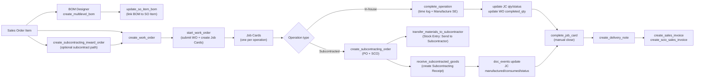
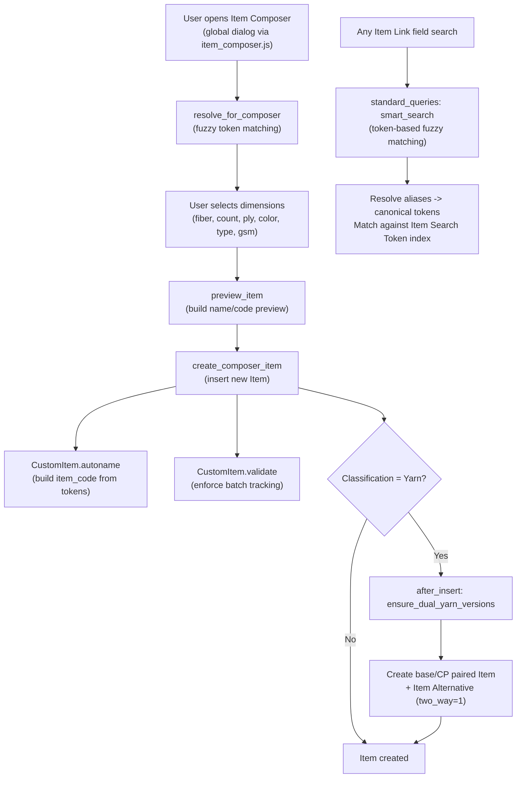
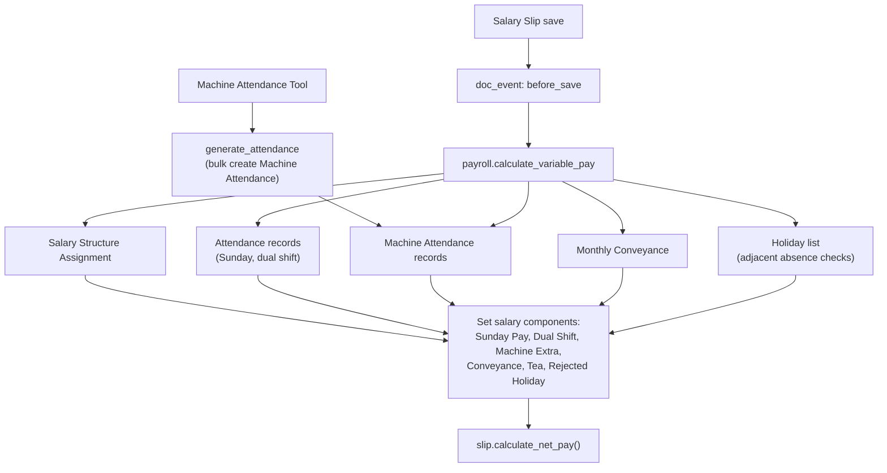

# KnitERP Architecture (Frappe v16)

Custom Frappe app for knitting/textile manufacturing. Extends ERPNext manufacturing, subcontracting, and payroll with textile-specific workflows, a simplified operational UI, and full batch/lot traceability.

---

## 1) Module Map

Which doctypes, pages, APIs, and JS files belong to each feature:

| Feature | Custom DocTypes | Pages | API Modules | Client JS | LOC (approx) |
|---------|----------------|-------|-------------|-----------|---------------|
| **Production Wizard** | Production Wizard Note | `production_wizard` | `api/production_wizard.py` (41 endpoints) | `page/production_wizard/production_wizard.js` | 5,124 + 4,523 |
| **Transaction Desk** | -- | `transaction_desk` | `api/transaction_desk.py` (7 endpoints) | `page/transaction_desk/transaction_desk.js` | 1,088 + 2,249 |
| **Action Center** | -- | `action_center` | `api/action_center.py` (4 endpoints) | `page/action_center/action_center.js` | 1,166 + 898 |
| **BOM Designer** | -- | `bom_designer` | `api/bom_tool.py` (2 endpoints) | `page/bom_designer/bom_designer.js` | 538 + 1,126 |
| **KnitERP Home** | -- | `kniterp_home` | `page/kniterp_home/kniterp_home.py` (1 endpoint) | `page/kniterp_home/kniterp_home.js` | 117 + 368 |
| **Item System** | Item Token, Item Token Alias, Item Search Token | -- | `api/item_composer.py` (6), `api/item_search.py` (2), `api/item.py` (hook) | `public/js/item_composer.js` | 546 + 482 + 1,008 |
| **Transaction Params** | Transaction Parameter, SO Transaction Parameter, PO Transaction Parameter | -- | `api/transaction_parameters.py` (2 sync hooks) | `public/js/sales_order.js`, `public/js/purchase_order.js` | 60 + 216 + 133 |
| **Subcontracting** | -- (extends ERPNext) | -- | `api/subcontracting.py` (2), `subcontracting.py` (hooks) | `public/js/sales_order_subcontracting_fix.js` | 74 + 198 + 57 |
| **HR / Payroll** | Machine Attendance, Machine Attendance Entry, Machine Attendance Tool, Monthly Conveyance | -- | `payroll.py` (hook) | `doctype/machine_attendance_tool/machine_attendance_tool.js` | 230 + 87 + 112 |
| **Stock Reservation** | -- | -- | `api/stock_reservation_service.py` | -- | 289 |
| **Access Control** | -- | -- | `api/access_control.py` (decorators) | -- | 48 |
| **Overrides** | -- | -- | 6 override files | -- | 1,329 |
| **Reports** | -- | -- | `report/subcontracted_batch_traceability/`, `report/monthly_salary_register/` | JS filter panels | 655+112 + 260+114 |
| **Print Format** | -- | -- | `print_format/tally_purchase_invoice/` | -- | JSON only |

| **Settings** | KnitERP Settings | -- | -- | -- | -- |

**Totals**: 12 custom doctypes, 5 pages, 69 `@frappe.whitelist` decorators (68 effective unique), ~22K LOC.

---

## 2) Custom DocTypes

| DocType | Type | Naming | Key behavior |
|---------|------|--------|-------------|
| Item Token | Master | `format:{canonical}` | Canonical dimension tokens (e.g., "Cotton", "30's"). 6 dimensions: fiber, count, ply, color, type, gsm. Foundation for item naming. |
| Item Token Alias | Master | `format:{alias}` | Fuzzy search mappings (e.g., "ctn" -> "Cotton"). ~248 fixture records. Cached at runtime with `frappe.cache`. |
| Item Search Token | Master | Autoincrement | Denormalized search index. Each record links one Item to one resolved token. Rebuilt on item save via `on_item_save` doc_event. |
| Transaction Parameter | Master | `format:{parameter_name}` | Master list of parameter types (GSM, Color) for SO/PO item-level data. 2 fixture records. |
| SO Transaction Parameter | Master | Random | Denormalized SO-item parameter records. Created/synced by `sync_so_params` doc_event on Sales Order save. Enables Report Builder queries. |
| PO Transaction Parameter | Master | Random | Same as above for Purchase Order items. Synced by `sync_po_params`. |
| Machine Attendance | Master | hash | Tracks operator/shift/machine production qty. Validates uniqueness, Operator designation, qty > 0. |
| Machine Attendance Entry | Child table | -- | Child rows for Machine Attendance Tool input (machine, morning/night employee, production kg). |
| Machine Attendance Tool | Single | -- | Operational UI tool. `generate_attendance` whitelisted method bulk-creates Machine Attendance records. |
| Monthly Conveyance | Master | hash | Employee conveyance ledger. `validate` auto-computes `amount = total_km * rate_per_km`. Used in payroll calculation. |
| Production Wizard Note | Master | Random | Free-text notes keyed to a Sales Order Item. Created/deleted via Production Wizard UI. |
| KnitERP Settings | Single | -- | Configurable defaults: 5 warehouse links (RM, FG, JW Outward, JW Inward Parent, JW Completed), machine extra rate/threshold, CP item suffix. Cached via `get_settings()`. Exposed to JS via `frappe.boot.kniterp_settings`. |

---

## 3) Data Flow Diagram

### Manufacturing / Subcontracting Flow



### Item Creation Flow



### Payroll Flow



---

## 4) Integration Points with ERPNext

### 4.1 hooks.py Overview (`hooks.py`)

**Import-time side effects** (lines 1-2):
```python
import kniterp.kniterp.overrides.job_card       # logger setup, class loaded
import kniterp.kniterp.overrides.sre_dashboard_fix  # guarded monkey patch
```

**Also in `__init__.py:4`**:
```python
import kniterp.kniterp.overrides.sre_dashboard_fix  # same patch, ensures loaded
```

### 4.2 override_doctype_class (`hooks.py:46`)

| ERPNext DocType | Override Class | File | Key Changes |
|-----------------|---------------|------|-------------|
| Item | `CustomItem` | `overrides/item.py` (119 lines) | Custom `autoname` from token dimensions, `validate` enforces naming, `after_insert` creates dual yarn versions (base + CP) with Item Alternative |
| Job Card | `CustomJobCard` | `overrides/job_card.py` (513 lines) | `set_status` removes auto-complete (manual completion only), `set_manufactured_qty` custom calc, `make_stock_entry_for_semi_fg_item` handles overproduction, skips time/transfer/JC validation for subcontracted cards, custom `on_submit` + `update_subsequent_operations` |
| Work Order | `CustomWorkOrder` | `overrides/work_order.py` (233 lines) | `validate_subcontracting_inward_order` custom SCIO checks |
| Subcontracting Inward Order | `CustomSubcontractingInwardOrder` | `overrides/subcontracting_inward_order.py` (143 lines) | `get_production_items` precision fix, `make_subcontracting_delivery` custom qty derivation |

### 4.3 override_whitelisted_methods (`hooks.py:53`)

| Original Method | Override | Purpose |
|-----------------|----------|---------|
| `erpnext...job_card.make_subcontracting_po` | `overrides/job_card.py:52` | Custom PO mapping with supplier and qty logic |

### 4.4 standard_queries (`hooks.py:58`)

| DocType | Handler | Purpose |
|---------|---------|---------|
| Item | `api/item_search.smart_search` | Replaces ALL Item link-field searches with fuzzy token-based search |

### 4.5 doc_events (`hooks.py:62`) -- 9 doctypes, 15 bindings

| DocType | Event | Handler | Purpose |
|---------|-------|---------|---------|
| Item | `before_save` | `api/item.enforce_batch_tracking_for_fabric_yarn` | Force `has_batch_no` on Fabric/Yarn |
| Item | `after_insert` | `api/item_search.on_item_save` | Rebuild search token index |
| Item | `on_update` | `api/item_search.on_item_save` | Rebuild search token index |
| Salary Slip | `before_save` | `payroll.calculate_variable_pay` | Recompute earnings/deductions |
| Sales Order | `on_update` | `api/transaction_parameters.sync_so_params` | Sync param JSON to denormalized records |
| Sales Order | `on_update_after_submit` | `api/transaction_parameters.sync_so_params` | Same on amended SO |
| Purchase Order | `on_update` | `api/transaction_parameters.sync_po_params` | Sync param JSON to denormalized records |
| Purchase Order | `on_update_after_submit` | `api/transaction_parameters.sync_po_params` | Same on amended PO |
| Work Order | `before_submit` | `overrides/work_order.set_planned_qty_on_work_order` | Set operation planned qty from BOM ratios |
| Job Card | `before_insert` | `overrides/job_card.set_job_card_qty_from_planned_qty` | Set `for_quantity` from WO operation planned qty |
| Purchase Receipt | `on_submit` | `subcontracting.on_pr_submit_complete_job_cards` | Update JC manufactured/status from PR |
| Subcontracting Receipt | `before_validate` | `overrides/subcontracting_receipt.before_validate_set_customer_warehouse` | Inject customer_warehouse fallback |
| Subcontracting Receipt | `on_submit` | `overrides/subcontracting_receipt.on_submit_complete_job_cards` | Update JC manufactured/consumed/status |
| Stock Entry | `on_submit` | `subcontracting.on_se_submit_update_job_card_transferred` | Recompute JC transferred_qty |
| Stock Entry | `on_cancel` | `subcontracting.on_se_cancel_update_job_card_transferred` | Recompute JC transferred_qty |

### 4.6 Monkey Patches (import-time, 2 active)

| Patch | File | What it replaces |
|-------|------|-----------------|
| `get_sre_reserved_qty_for_items_and_warehouses` | `overrides/sre_dashboard_fix.py:64` | SRE reserved qty computation (adds consumed_qty) |
| `get_sre_reserved_qty_details_for_voucher` | `overrides/sre_dashboard_fix.py:65` | Voucher-level reserved qty details |

Both are guarded with version checks. Previously a `SubcontractingReceipt.validate` monkey patch existed but has been replaced by a proper `before_validate` doc_event.

### 4.7 doctype_list_js (`hooks.py:140`)

| DocType | JS File | Effect |
|---------|---------|--------|
| Sales Order | `public/js/sales_order_list.js` | Redirects "+ Add" to Transaction Desk |
| Purchase Order | `public/js/purchase_order_list.js` | Redirects "+ Add" to Transaction Desk |

### 4.8 app_include_js (`hooks.py:35`)

Loaded globally on every desk page:
1. `public/js/item_composer.js` (912 lines) -- global item creation dialog
2. `public/js/sales_order_subcontracting_fix.js` (57 lines) -- item query filter fix
3. `public/js/sales_order.js` (216 lines) -- subcontracted PO dialog + transaction params
4. `public/js/purchase_order.js` (133 lines) -- transaction parameter UI

### 4.9 after_install / after_migrate (`hooks.py:183-184`)

Both call `kniterp.kniterp.install.after_migrate` which:
- Creates custom fields (Salary Slip `custom_per_day_salary`) if missing
- Creates property setters (Salary Slip layout) if missing
- Creates 3 service Items (Knitting Jobwork, Dyeing Jobwork, Yarn Processing) if missing
- Creates 6 Salary Components (Sunday Pay, Dual Shift Pay, Machine Extra Pay, Conveyance Allowance, Tea Allowance, Rejected Holiday Deduction) if missing
- Hides 29 standard ERPNext/Frappe workspaces (CRM, Selling, Buying, Stock, Manufacturing, etc.)
- Restricts hidden workspaces to Administrator role only
- Pushes non-KnitERP desktop icons to bottom of navigation

### 4.10 extend_bootinfo (`hooks.py`)

`kniterp.boot.get_bootinfo` injects `frappe.boot.kniterp_settings` (cached KnitERP Settings dict) into every desk session for client-side access to warehouse defaults, rates, and suffixes.

---

## 5) Custom Fields on ERPNext DocTypes

From `fixtures/custom_field.json` (11 fields):

| # | Target DocType | Field Name | Type | Purpose |
|---|----------------|------------|------|---------|
| 1 | Machine Attendance | `job_card_time_log` | Data | Links attendance to Job Card Time Log |
| 2 | Job Card Time Log | `workstation` | Link (Workstation) | Workstation used during time log |
| 3 | Work Order Operation | `custom_planned_output_qty` | Float (read-only) | Planned output qty from BOM ratios |
| 4 | Batch | `source_type` | Select (Supplier/Customer/In-house) | Batch material origin for traceability |
| 5 | Batch | `custom_parent_batch` | Link (Batch) | Upstream parent batch linkage |
| 6 | SCR Item | `custom_consumed_batch_no` | Small Text | Knitting batch sent for dyeing |
| 7 | SCR Item | `custom_output_dyeing_lot` | Small Text | Dyeing lot produced by subcontractor |
| 8 | SO Item | `custom_transaction_params_json` | Small Text (hidden) | JSON storage for transaction parameters |
| 9 | PO Item | `custom_transaction_params_json` | Small Text (hidden) | JSON storage for transaction parameters |
| 10 | Job Card | `custom_consumed_lot_no` | Small Text | Yarn/fabric lot consumed in this operation |
| 11 | Job Card | `custom_output_batch_no` | Small Text | New batch/lot produced by this operation |

### Batch/Lot Traceability Chain

```
Yarn Purchase (Batch.source_type = "Supplier")
  -> Knitting (JC.custom_consumed_lot_no = yarn batch)
    -> Knitting Output (JC.custom_output_batch_no = fabric batch)
      -> Dyeing Subcontract (SCR Item.custom_consumed_batch_no = fabric batch)
        -> Dyeing Output (SCR Item.custom_output_dyeing_lot = dyed lot)
          -> Parent linkage (Batch.custom_parent_batch = upstream batch)
```

---

## 6) Property Setters

From `fixtures/property_setter.json` (10 records):

| # | DocType | Field | Property | Value | Effect |
|---|---------|-------|----------|-------|--------|
| 1 | Employee | _(doctype)_ | `show_title_field_in_link` | 1 | Show employee name in Link dropdowns |
| 2 | Employee | _(doctype)_ | `field_order` | _(custom)_ | Reorder Employee form fields |
| 3 | Machine Attendance | _(doctype)_ | `allow_import` | 1 | Enable bulk CSV import |
| 4-9 | Purchase Order | Various (`supplier_name`, `per_billed`, `per_received`, `transaction_date`, `grand_total`, `is_subcontracted`) | `in_list_view` | 1 | Show key columns in PO list view |
| 10 | Job Card | `barcode` | `hidden` | 0 | Make barcode field visible |

---

## 7) Fixtures, Patches, and Scripts

### Fixtures (from `hooks.py:99`)

| Fixture | Filter | Records | Purpose |
|---------|--------|--------:|---------|
| Transaction Parameter | All | 2 | Parameter types: GSM, Color |
| Item Token Alias | All | 248 | Fuzzy search mappings (e.g., "ctn" -> "Cotton") |
| Designation | name in [Master, Helper, Operator] | 3 | Employee role categories |
| Client Script | module = Kniterp | 0 | Empty placeholder |
| Property Setter | module = Kniterp | 10 | See Section 6 |
| Custom Field | module = Kniterp | 11 | See Section 5 |
| Print Format | module = Kniterp | 1+ | Tally Purchase Invoice |
| Workstation Type | name in [Knitting Job Work, Knitting in-house, Dyeing Job Work, Yarn Processing] | 4 | Manufacturing workstation types |

### after_migrate Created Records (create-if-not-exists)

| DocType | Records | Purpose |
|---------|---------|---------|
| Item | Knitting Jobwork, Dyeing Jobwork, Yarn Processing | Service items for subcontracting BOMs (HSN 998821) |
| Salary Component | Sunday Pay, Dual Shift Pay, Machine Extra Pay, Conveyance Allowance, Tea Allowance, Rejected Holiday Deduction | Payroll variable pay components |

### Patches
`patches.txt` is empty -- no active migration patches.

### Seed Scripts (not registered as patches, run manually)
- `api/seed_aliases.py` -- seeds Item Token Alias records
- `api/seed_item_tokens.py` -- seeds Item Token records from existing items
- `api/seed_test_items.py` -- creates test Item records for development

### Custom Reports
| Report | Type | Path | LOC (py + js) | Purpose |
|--------|------|------|---------------|---------|
| Subcontracted Batch Traceability | Script Report | `report/subcontracted_batch_traceability/` | 655 + 112 | Lot/batch tracking across subcontracting pipeline (yarn -> knitting -> dyeing) |
| Monthly Salary Register | Script Report | `report/monthly_salary_register/` | 260 + 114 | Employee payroll summary with variable pay component breakdown (Sunday Pay, Dual Shift, Machine Extra, etc.) |

### Custom Print Format
| Format | Path | Purpose |
|--------|------|---------|
| Tally Purchase Invoice | `print_format/tally_purchase_invoice/` | Tally-compatible PI layout for users migrating from Tally |

### Workspaces (10)
Billing, Employees, Inventory, KnitERP, Outsourcing, Payroll Management, Production, Purchases, Sales, Time & Attendance

### Tests
- `tests/test_p0_critical_fixes.py` -- critical fix regression tests
- `tests/test_smart_search.py` -- item search token matching tests

---

## 8) API Endpoint Summary

69 total `@frappe.whitelist()` decorators across 11 files (68 effective unique -- `complete_job_card` defined twice in production_wizard.py):

| File | Endpoints | Key methods |
|------|----------:|-------------|
| `api/production_wizard.py` | 41 | `get_pending_production_items`, `create_work_order`, `start_work_order`, `create_subcontracting_order`, `complete_operation`, `complete_job_card`, `revert_production_entry`, `receive_subcontracted_goods`, `create_delivery_note`, `create_sales_invoice`, `get_batch_production_summary`, `get_lot_traceability`, `save_lot_references`, `ensure_batch_exists` |
| `api/transaction_desk.py` | 7 | `get_item_details`, `get_defaults`, `create_transaction`, `get_tax_details`, `get_default_tax_template`, `get_party_tax_template`, `get_recent_transactions` |
| `api/item_composer.py` | 6 | `get_composer_options`, `resolve_for_composer`, `preview_item`, `create_composer_item`, `add_new_token` |
| `api/action_center.py` | 4 | `get_action_items`, `get_fix_details`, `create_purchase_invoice`, `submit_purchase_invoice` |
| `api/item_search.py` | 2 | `smart_search` (used as standard_query for all Item links), `rebuild_all_search_tokens` |
| `api/subcontracting.py` | 2 | `get_subcontract_po_items`, `make_subcontract_purchase_order` |
| `api/bom_tool.py` | 2 | `create_multilevel_bom`, `get_multilevel_bom` |
| `overrides/job_card.py` | 2 | `make_subcontracting_po`, `CustomJobCard.make_stock_entry_for_semi_fg_item` |
| `overrides/subcontracting_inward_order.py` | 1 | `CustomSubcontractingInwardOrder.make_subcontracting_delivery` |
| `doctype/machine_attendance_tool/` | 1 | `generate_attendance` |
| `page/kniterp_home/kniterp_home.py` | 1 | `get_dashboard_metrics` |

### Supporting (non-whitelisted) modules

| File | Purpose |
|------|---------|
| `api/access_control.py` | Role-checking decorators (`require_production_write_access`, etc.) |
| `api/stock_reservation_service.py` | SRE/Bin management for SCIO-linked Work Orders |
| `api/transaction_parameters.py` | `sync_so_params` / `sync_po_params` doc_event handlers |
| `api/item.py` | `enforce_batch_tracking_for_fabric_yarn` doc_event handler |
| `subcontracting.py` | Stock Entry / Purchase Receipt doc_event handlers for JC updates |
| `payroll.py` | `calculate_variable_pay` Salary Slip doc_event handler |
| `boot.py` | `get_bootinfo` injects KnitERP Settings into `frappe.boot` |

---

## 9) Client-Side JS Customizations

### Global Scripts (app_include_js, loaded on all desk pages)

| File | Lines | Purpose |
|------|------:|---------|
| `public/js/item_composer.js` | 912 | Global item creation dialog. Token-based dimension selection (fiber, count, ply, color, type, gsm). 3 frappe.ui.Dialog instances. |
| `public/js/sales_order_subcontracting_fix.js` | 57 | Mutates item query filter on SO form based on `is_subcontracted` flag. |
| `public/js/sales_order.js` | 216 | Adds "Create Subcontracted PO" button + transaction parameter dialog on SO form. |
| `public/js/purchase_order.js` | 133 | Adds transaction parameter dialog on PO form. |

### List View Overrides (doctype_list_js)

| File | Lines | Purpose |
|------|------:|---------|
| `public/js/sales_order_list.js` | 9 | Redirects "+ Add Sales Order" to `/app/transaction-desk` |
| `public/js/purchase_order_list.js` | 9 | Redirects "+ Add Purchase Order" to `/app/transaction-desk` |

### Page Controllers

| Page | JS Lines | CSS | Purpose |
|------|------:|-----|---------|
| `production_wizard` | 3,873 | Yes | Primary orchestrator. 11 dialogs. SO-item-wise manufacturing management. |
| `transaction_desk` | 2,249 | Yes | Rapid voucher creation for 16 transaction types (SO, PO, SI, PI, PE, JE, DN, PR, SE, Debit/Credit Note, Job Work In/Out). |
| `bom_designer` | 1,126 | Yes | Multi-level BOM creation with phase A + master + subcontracting BOM. |
| `action_center` | 898 | Yes | Operational dashboard. 9 action cards (RM shortage through invoicing). 3 dialogs. |
| `kniterp_home` | 368 | Yes | Home dashboard with metrics (pending orders, production status, etc.). |

### DocType JS
| File | Lines | Purpose |
|------|------:|---------|
| `doctype/machine_attendance_tool/machine_attendance_tool.js` | 112 | Form actions + generate_attendance API call |

### CSS
| File | Lines | Purpose |
|------|------:|---------|
| `public/css/kniterp.css` | 42 | Global custom styling |

---

## 10) File Tree (significant files only)

```
kniterp/
  __init__.py                          # v1.2.0 + SRE patch import
  hooks.py                             # All hook registrations (351 lines)
  boot.py                              # extend_bootinfo: injects KnitERP Settings into JS
  payroll.py                           # Salary Slip before_save handler (230 lines)
  subcontracting.py                    # SE/PR doc_event handlers for JC (198 lines)
  modules.txt                          # Module: Kniterp
  patches.txt                          # Empty

  api/
    access_control.py                  # Role decorators (48 lines)
    action_center.py                   # Action Center API (1,166 lines, 4 endpoints)
    bom_tool.py                        # BOM creation API (538 lines, 2 endpoints)
    item.py                            # Item before_save hook (8 lines)
    item_composer.py                   # Item Composer API (546 lines, 6 endpoints)
    item_search.py                     # Smart search + token index (482 lines, 2 endpoints)
    production_wizard.py               # Core orchestrator (5,124 lines, 41 endpoints)
    seed_aliases.py                    # Seed Item Token Aliases (310 lines)
    seed_item_tokens.py                # Seed Item Tokens (179 lines)
    seed_test_items.py                 # Seed test Items (139 lines)
    stock_reservation_service.py       # SRE/Bin management (289 lines)
    subcontracting.py                  # Subcontracting API (74 lines, 2 endpoints)
    transaction_desk.py                # Transaction Desk API (1,088 lines, 7 endpoints)
    transaction_parameters.py          # SO/PO param sync hooks (60 lines)

  kniterp/
    install.py                         # after_migrate: setup fields, service items, salary components, hide workspaces

    overrides/
      item.py                          # CustomItem (119 lines)
      job_card.py                      # CustomJobCard (557 lines)
      work_order.py                    # CustomWorkOrder (256 lines)
      subcontracting_inward_order.py   # CustomSubcontractingInwardOrder (143 lines)
      subcontracting_receipt.py        # SCR doc_event handlers (123 lines)
      sre_dashboard_fix.py             # SRE monkey patches (131 lines)

    doctype/
      item_token/                      # Canonical dimension tokens
      item_token_alias/                # Fuzzy search aliases
      item_search_token/               # Denormalized search index
      transaction_parameter/           # Parameter type master
      so_transaction_parameter/        # SO param denormalized records
      po_transaction_parameter/        # PO param denormalized records
      machine_attendance/              # Operator production tracking
      machine_attendance_entry/        # Child table for MAT
      machine_attendance_tool/         # Bulk attendance generator (Single)
      monthly_conveyance/              # Employee conveyance ledger
      production_wizard_note/          # SO-item notes
      kniterp_settings/              # Single: configurable defaults (warehouses, rates, suffix)

    page/
      production_wizard/               # /app/production-wizard
      transaction_desk/                # /app/transaction-desk
      action_center/                   # /app/action-center
      bom_designer/                    # /app/bom-designer
      kniterp_home/                    # /app/kniterp-home

    report/
      subcontracted_batch_traceability/  # Script report (655 + 112 lines)
      monthly_salary_register/           # Script report (260 + 114 lines)

    print_format/
      tally_purchase_invoice/          # Tally-compatible PI layout

    workspace/                         # 10 workspace JSON configs

    custom/
      item.json                        # Item form customization
      work_order.json                  # Work Order form customization

  public/
    js/
      item_composer.js                 # Global item creation dialog (912 lines)
      sales_order.js                   # SO form extensions (216 lines)
      purchase_order.js                # PO form extensions (133 lines)
      sales_order_subcontracting_fix.js  # SO query fix (57 lines)
      sales_order_list.js              # Redirect to Transaction Desk (9 lines)
      purchase_order_list.js           # Redirect to Transaction Desk (9 lines)
    css/
      kniterp.css                      # Custom styles (42 lines)

  fixtures/
    custom_field.json                  # 11 custom fields on ERPNext doctypes
    property_setter.json               # 10 property setters
    client_script.json                 # Empty (0 records)
    transaction_parameter.json         # 2 records (GSM, Color)
    item_token_alias.json              # 248 fuzzy search aliases
    designation.json                   # 3 records (Master, Helper, Operator)
    workstation_type.json              # 4 records (Knitting Job Work, Knitting in-house, Dyeing Job Work, Yarn Processing)

  desktop_icon/                        # 10 desktop icon configs
  workspace_sidebar/                   # 10 sidebar configs
  tests/
    test_p0_critical_fixes.py
    test_smart_search.py
```

---

## 11) Knowledge Gaps (To Investigate)

### High Priority

1. **Permission gaps in write APIs** -- `action_center.py:create_purchase_invoice()` and `submit_purchase_invoice()` lack explicit `frappe.has_permission()` checks. Relies solely on `@frappe.whitelist()` + role-based page access.

2. **Monkey patches upgrade risk** -- Two SRE dashboard patches (`sre_dashboard_fix.py:64-65`) will break if ERPNext changes the patched functions' signatures or behavior on upgrade. Currently guarded but fragile.

3. **`ignore_permissions=True` audit** -- Used in 10+ write paths (item creation, machine attendance, stock entries, BOM creation). Need to verify each is justified.

4. **N+1 query patterns** -- `get_consolidated_shortages()` loops over items calling `get_production_details()` per item. `action_center.py` has 25 SQL call sites. Performance concern at scale.

### Medium Priority

5. **Test coverage** -- Only 2 test files. Core manufacturing, subcontracting, and payroll flows lack automated tests.

6. **Transaction Desk edge cases** -- 16 voucher types with varying creation logic. Not all paths have been fully reviewed.

7. **Direct `db_set` mutations** -- 27+ calls to `db_set` bypass document validation. Most are status/qty updates on Job Card and related docs. Need to verify each is safe.

### Low Priority

8. **Action Center deep review** -- 1,166-line API with complex action categorization. Need full analysis of all 9 action types.

9. **Monolithic files** -- `production_wizard.py` (4,727 lines) and `production_wizard.js` (3,873 lines) are large. Consider splitting into domain services if new features are added.
